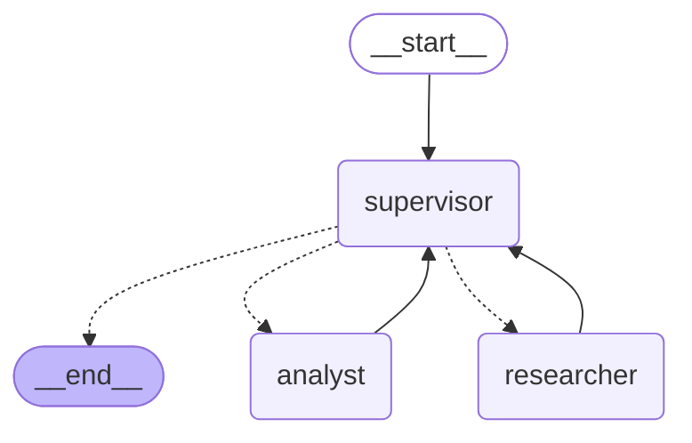
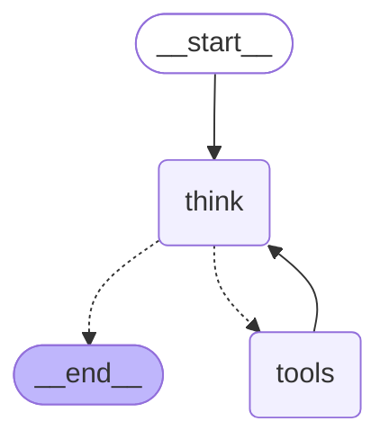

# Pre-entrega 6 - Orquestador multi-agente especializado

Un equipo de tres agentes que investiga incidentes de PayFlow, construido con **LangGraph** en el patrón Supervisor. El **Supervisor** lee la pregunta de la persona de guardia y decide quién trabaja: el **Researcher** junta evidencia (logs, catálogo de errores, runbooks, arquitectura) y el **Analyst** hace cuentas sobre esa evidencia e interpreta. Cuando alcanza, el Supervisor escribe la respuesta final.

El modelo es `openai/gpt-oss-120b` en **Groq**, como en la Pre-entrega 5 ([su ADR](../preentrega-5/docs/adr/0001-groq-instead-of-openai.md)). El vocabulario del proyecto está en [CONTEXT.md](CONTEXT.md).

## Estructura

```
state.py               # OrchestratorState: mensajes, Evidence, Delegations y campos de control
schemas.py             # LogLine, ErrorCodeEntry, Evidence, Delegation, Contribution, DelegationTrace
agents/
  supervisor.py        # decisión estructurada (SupervisorDecision), Delegation Limit, Override y respuesta final
  researcher.py        # las cuatro tools de búsqueda y el nodo del Researcher
  analyst.py           # las tres tools de cómputo y el nodo del Analyst
  specialist.py        # el subgrafo ReAct que comparten los dos especialistas
graph.py               # StateGraph, aristas condicionales, recursion_limit y run_investigation
main.py                # demo con la traza de delegación en consola y en trace.json
trace.json             # traza de una ejecución real de la demo
data/                  # logs, catálogo, runbooks (de la P5) y arquitectura (de la P4) de PayFlow
docs/adr/              # por qué la Evidence viaja como estado estructurado
tests/                 # pytest con un modelo de chat guionado, sin red
```

## Instalación

Con [uv](https://docs.astral.sh/uv/), desde `preentrega-6/`:

```bash
uv sync
```

O con pip:

```bash
python3.12 -m venv .venv
source .venv/bin/activate
pip install -r requirements.txt
```

## Configuración

El `.env` es el mismo de las otras pre-entregas y está en la raíz del repositorio:

```bash
cp ../.env.example ../.env
```

Solo hace falta `GROQ_API_KEY` (gratuita en https://console.groq.com/keys). `GROQ_MODEL` es opcional y por defecto vale `openai/gpt-oss-120b`. Si lo cambiás, tiene que ser un modelo con tool calling y salida estructurada.

## Ejecución

```bash
uv run python main.py                       # la demo
uv run python main.py "¿Qué pasó el 29/09/2026 a las 10?"   # otra pregunta
uv run python main.py --mermaid             # imprime el diagrama del grafo
```

La demo pregunta por el incidente del 28/09/2026. Al terminar imprime cada Delegation con su motivo, cada Contribution con las tools que usó el especialista, el recorrido completo y la respuesta final, y guarda la traza en `trace.json` (una pregunta suelta la guarda en `trace-pregunta.json`).

Con la capa gratuita de Groq (8000 tokens por minuto) una investigación tarda entre uno y tres minutos: el SDK espera solo cuando llega al límite y después sigue.

Salida de una ejecución real (la respuesta final está recortada; completa en `trace.json`):

```
[supervisor] delega en researcher: Recopilar evidencia de los logs, catálogo de errores, runbooks y arquitectura de PayFlow para el 28/09/2026 alrededor de 21:15, enfocándose en los servicios involucrados en los pagos fallidos.
             porque: Necesitamos la evidencia antes de poder analizarla.
  [researcher] llama a buscar_en_logs({'desde': '21:00', 'fecha': '2026-09-28', 'hasta': '21:30'})
  [researcher] llama a buscar_codigo_error({'codigo': 'PF-5001'})
  [researcher] llama a buscar_en_logs({'desde': '21:00', 'fecha': '2026-09-28', 'hasta': '21:30', 'texto': 'ERROR'})
  [researcher] llama a buscar_codigo_error({'codigo': 'PF-5030'})
  [researcher] llama a leer_runbook({'nombre': 'base-de-datos-no-responde'})
  [researcher] aporta: **Evidencia encontrada** | Hora | Servicio | Mensaje del log | Tipo | [...]

[supervisor] delega en analyst: Calcula cuántos errores hubo por cada servicio (pagos‑api, pgbouncer, pagos‑worker, postgres) en el rango mostrado, determina la duración total del incidente (desde el primer error hasta el último error) y resume la causa raíz y mitigación según el runbook.
             porque: El researcher ya reunió evidencia pero faltan los cálculos y la síntesis que solo el analyst puede proporcionar.
  [analyst] llama a contar_por_servicio({})
  [analyst] llama a ventana_de_errores({})
  [analyst] aporta: **Errores por servicio (rango mostrado)** - **pagos‑api:** 4 ERROR, 1 WARN, 2 INFO - **pagos‑worker:** 1 [...]

[supervisor] termina: El analista ya proporcionó los conteos, duración, causa raíz y pasos de mitigación; no falta información para responder al usuario.

Recorrido: supervisor -> researcher -> supervisor -> analyst -> supervisor -> END

**Errores por servicio (rango mostrado)**

| Servicio | ERROR | WARN | INFO |
|----------|-------|------|------|
| pagos‑api | 4 | 1 | 2 |
| pagos‑worker | 1 | 1 | – |
| pgbouncer | – | 1 | 1 |
| postgres | – | – | 1 |

**Duración**
- Primer error registrado: 21:14:09 (`PoolTimeout`).
- Último error registrado: 21:14:20 (`503 Service Unavailable`).
- **Tiempo total con errores:** ≈ 11 segundos (≈ 27 errores/minuto).

**Causa raíz**
Saturación del pool de conexiones de **pagos‑api**, que llevó a PgBouncer a quedarse sin conexiones disponibles (código PF‑5030). [...]

**Qué hacer si vuelve a ocurrir** (runbook **“base-de-datos-no-responde”**)
[...]
```

Algunas cosas que se ven en la traza:

- `PF-5001` no existe en el catálogo. La tool devolvió la lista de códigos válidos y el Researcher siguió con `PF-5030`, que sí corresponde a los síntomas.
- Los números de la tabla y la duración son los que devolvieron `contar_por_servicio` y `ventana_de_errores`. El Supervisor los copió en la respuesta final sin recalcularlos.
- Ni el Supervisor ni el Analyst vieron los resultados de las tools del Researcher: solo su aporte, con las líneas que él eligió citar. El Analyst además ve lo que devuelven sus propias tools, calculado sobre la Evidence completa.

## Los agentes

### Supervisor (`agents/supervisor.py`)

No consulta datos. En cada vuelta recibe la pregunta, cuántas Delegations lleva y los aportes del equipo, y responde con `with_structured_output(SupervisorDecision)`:

```python
class SupervisorDecision(BaseModel):
    next: Literal["researcher", "analyst", "FINISH"]
    instruction: str   # la tarea concreta para el especialista
    reason: str        # por qué, para la traza
```

`next` es un `Literal`, así que el modelo no puede inventar un destino: lo que no valida contra el esquema no llega al grafo. Cuando elige `FINISH` hace una segunda llamada, sin esquema, para escribir la respuesta final con los aportes.

Dos reglas no dependen del modelo:

- **Override**: si elige al Analyst antes de que el Researcher haya aportado algo, la tarea se le manda al Researcher con la misma instrucción y queda marcada en la traza. El Analyst no tiene acceso a ninguna fuente, así que sin investigación previa no tendría con qué trabajar.
- **Delegation Limit**: después de 4 Delegations no se le pregunta nada más al modelo y el Supervisor escribe la respuesta final con lo que tiene.

### Researcher (`agents/researcher.py`)

Junta evidencia y cuenta lo que encontró, sin sacar conclusiones. Tiene cuatro tools (`@tool` con `args_schema` de Pydantic):

| Tool | Argumentos | Devuelve |
|---|---|---|
| `buscar_en_logs` | `texto`, `servicio`, `fecha`, `desde` y `hasta` (`HH:MM`), todos opcionales | las líneas que coinciden ordenadas por hora (en el texto, máximo 20; en la Evidence, todas); sin coincidencias, los servicios y fechas que tienen logs |
| `buscar_codigo_error` | `codigo` (`PF-` y cuatro dígitos) | título, HTTP, causa y runbook; si el código no existe, los válidos |
| `leer_runbook` | `nombre` | el runbook completo; si no existe, los disponibles |
| `leer_arquitectura` | `documento` | el documento de arquitectura; si no existe, los disponibles |

Las tools usan `response_format="content_and_artifact"`. El modelo lee el texto, y las Log Lines y Error Codes que se encontraron viajan aparte como objetos `Evidence`. El nodo los junta y los agrega al campo `evidence` del estado global.

### Analyst (`agents/analyst.py`)

Calcula e interpreta: qué servicio falló primero, cómo se propagó la falla, cuál parece la causa raíz y qué impacto tuvo. No tiene acceso a los logs ni a otras fuentes: sus tools leen la `evidence` del estado con `InjectedState`, así que el modelo no ve ese argumento y no puede inventarlo.

| Tool | Argumentos | Devuelve |
|---|---|---|
| `contar_por_servicio` | ninguno | ERROR, WARN e INFO por servicio, con los que más errores tuvieron primero |
| `ventana_de_errores` | ninguno | primera señal, primer y último ERROR, duración y errores por minuto |
| `linea_de_tiempo` | `nivel_minimo`, `servicio`, opcionales | las líneas en orden con los segundos desde la primera |

Los números los calcula el código, no el modelo. Por qué: [ADR 0001](docs/adr/0001-evidence-in-shared-state.md).

### Aislamiento de contexto

Cada especialista es un subgrafo ReAct propio (`agents/specialist.py`: `think` → `tools` → `think`), con su propio estado. Al entrar recibe un solo mensaje: la pregunta del usuario, los aportes anteriores del equipo y su instrucción. Sus tool calls y resultados quedan en ese subgrafo. Al estado global solo vuelve su Contribution, como `AIMessage(name="researcher" | "analyst")`, más la Evidence en el caso del Researcher.

Así, el Supervisor nunca ve líneas de log crudas y el Analyst no ve las búsquedas que no dieron resultado. Hay un test que lo verifica.

## El grafo

Generado con `uv run python main.py --mermaid`:



Cada especialista por dentro (el mismo subgrafo con distintas tools y distinto prompt):



Las líneas punteadas son aristas condicionales. Del Supervisor sale una sola (`next_step`), que lee `next_agent` del estado y va a `researcher`, `analyst` o `END`. Los dos especialistas vuelven siempre al Supervisor: ninguno puede terminar el flujo ni pasarle el trabajo directamente al otro.

### Estado

```python
class OrchestratorState(TypedDict):
    messages: Annotated[list[AnyMessage], add_messages]      # pregunta, Contributions y respuesta final
    evidence: Annotated[Evidence, merge_evidence]            # Log Lines y Error Codes, sin duplicados
    delegations: Annotated[list[Delegation], operator.add]   # cada decisión del Supervisor
    sender: str                                              # quién escribió el último paso
    next_agent: NotRequired[NextAgent]                       # lo que decidió el Supervisor
    instruction: NotRequired[str]                            # la tarea del especialista que sigue
    finish_reason: NotRequired[str]                          # por qué terminó
```

`merge_evidence` suma la Evidence nueva a la que ya había, sin repetir: si el Researcher trae dos veces la misma línea en dos búsquedas distintas, el Analyst la cuenta una sola vez.

### Control de bucles

Hay tres topes, del más específico al más general:

1. **Rondas de tools por especialista**: después de 5 rondas, el especialista recibe una última llamada al modelo sin tools y con la indicación de responder con lo que tiene. (Con `tool_choice="none"` el modelo a veces igual intentaba llamar una tool y Groq rechazaba la respuesta.) Su subgrafo además corre con `recursion_limit=13`.
2. **Delegation Limit**: 4 Delegations y el Supervisor termina, sin consultar al modelo.
3. **`recursion_limit=12`** en el `astream` del grafo externo. El camino más largo posible (4 Delegations) usa 9 pasos, así que este límite es una red de seguridad. Si llegara a saltar, `run_investigation` captura el `GraphRecursionError` y lo registra en la traza.

## Tests

```bash
uv run pytest
uv run mypy .
```

`test_graph.py` corre el grafo completo con `ScriptedChatModel`, un modelo que responde con una lista fija de mensajes, sin red. Cubre:

- el recorrido `supervisor → researcher → supervisor → analyst → supervisor → END` con la traza de cada paso;
- el aislamiento: los resultados crudos de las tools del Researcher no llegan ni al Supervisor ni al Analyst;
- el Override cuando se elige al Analyst antes de investigar;
- el Delegation Limit con un Supervisor que nunca termina;
- que la misma evidencia encontrada dos veces se cuenta una sola vez;
- un especialista que agota sus rondas de tools y responde igual.

`test_researcher.py` y `test_analyst.py` prueban las tools contra los datos reales. Los valores esperados del Analyst están calculados a mano a partir del log del 28/09.
