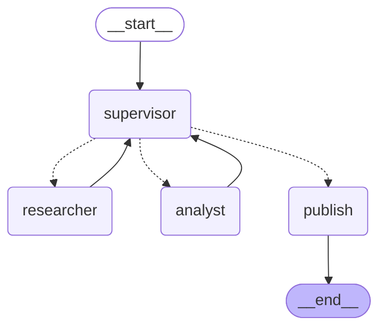

# Pre-entrega 7 - API de producción y monitoreo activo

El orquestador de incidentes de la Pre-entrega 6 (Supervisor, Researcher y Analyst sobre los datos de PayFlow) servido como API REST con **FastAPI**:

- las investigaciones corren en segundo plano;
- el estado y los checkpoints se guardan en **Redis**;
- ningún informe sale hacia el canal de incidentes sin la aprobación de una persona (human-in-the-loop);
- cada ejecución queda trazada en **Arize Phoenix**, con latencia, tokens y costo.

El vocabulario del proyecto está en [CONTEXT.md](CONTEXT.md). Por qué los trabajos corren dentro del proceso de la API: [ADR 0001](docs/adr/0001-jobs-run-inside-the-api-process.md).

## Estructura

```
app/
  main.py            # FastAPI: endpoints, ciclo de vida y armado de Redis, AsyncRedisSaver y grafo
  worker.py          # JobRunner: ejecuta el grafo en segundo plano, actualiza estados, tokens y costo
  jobs.py            # JobStore: el registro de cada trabajo en Redis, con transiciones atómicas
  hitl.py            # el nodo publish con interrupt() y el canal de incidentes en Redis
  graph.py           # el grafo de la P6 con checkpointer y el nodo publish; start_job / resume_job
  observability.py   # Phoenix (OpenInference) para LangChain y LangGraph
  schemas.py         # Job, Approval, Usage y los modelos de la P6
  state.py           # estado del grafo
  agents/            # Supervisor, Researcher, Analyst (de la P6) y guards.py: timeout y reintentos por 429
load_test.py         # prueba de concurrencia: 5 trabajos simultáneos, p95 y costo
load_test_results.json
screenshots/         # capturas del dashboard de Phoenix
docker-compose.yml   # Redis 8, Phoenix y la API
Dockerfile
data/                # logs, catálogo, runbooks y arquitectura de PayFlow
tests/               # pytest con un modelo guionado, fakeredis y checkpointer en memoria
```

## Cómo levantarlo

El `.env` es el de todas las pre-entregas y está en la raíz del repo (`cp ../.env.example ../.env`). Solo hace falta `GROQ_API_KEY`.

### Todo con Docker

```bash
docker compose up -d --build
```

| Servicio | Dirección |
|---|---|
| API (documentación interactiva) | http://localhost:8000/docs |
| Phoenix | http://localhost:6006 |
| Redis | `localhost:6379` |

El compose usa Redis 8, que ya incluye los módulos de búsqueda y JSON que necesita `RedisSaver`. Con `redis:7` el checkpointer no arranca.

### API local, Redis y Phoenix en Docker

Para desarrollar sin reconstruir la imagen:

```bash
docker compose up -d redis phoenix
uv sync
PHOENIX_COLLECTOR_ENDPOINT=http://localhost:6006/v1/traces uv run uvicorn app.main:app --port 8000
```

### Variables

| Variable | Por defecto | Para qué |
|---|---|---|
| `GROQ_API_KEY` | (obligatoria) | el modelo |
| `GROQ_MODEL` | `openai/gpt-oss-120b` | la prueba de carga usa `openai/gpt-oss-20b` (ver más abajo) |
| `REDIS_URL` | `redis://localhost:6379` | trabajos, checkpoints y canal de incidentes |
| `PHOENIX_COLLECTOR_ENDPOINT` | vacía (sin trazas) | `http://localhost:6006/v1/traces` |
| `PHOENIX_PROJECT_NAME` | `incident-orchestrator` | proyecto en Phoenix |
| `MAX_CONCURRENT_JOBS` | `5` | trabajos ejecutándose a la vez; el resto espera en `PENDING` |
| `JOB_TTL_DAYS` | `7` | cuánto viven en Redis los trabajos y sus checkpoints |

## Endpoints

### `POST /tasks`

Crea el trabajo, lo deja corriendo en segundo plano y responde enseguida con `202`:

```bash
curl -X POST localhost:8000/tasks -H 'content-type: application/json' \
  -d '{"question": "¿Qué pasó el 28/09/2026 a las 21:15 y qué hay que hacer si se repite?"}'
```

```json
{"id": "8c0d0831b9de497f9532dacd7033536f", "status": "PENDING", "question": "...", "created_at": "...", "steps": [], ...}
```

El `id` es también el `thread_id` del checkpointer: un trabajo es una conversación del grafo.

### `GET /tasks/{id}`

Devuelve el trabajo tal como está guardado en Redis. Consultarlo no toca el grafo:

| Campo | Contenido |
|---|---|
| `status` | `PENDING`, `RUNNING`, `PAUSED_FOR_APPROVAL`, `DONE` o `FAILED` |
| `steps` | la traza de delegación hasta el momento (Delegations y Contributions), que se actualiza mientras corre |
| `draft` | el informe que espera aprobación, solo en `PAUSED_FOR_APPROVAL` |
| `final_answer`, `published`, `approval` | al terminar: el informe, si se publicó y quién decidió |
| `error` | en `FAILED`, el tipo de excepción y su mensaje |
| `created_at`, `started_at`, `paused_at`, `decided_at`, `finished_at` | los momentos de cada transición |
| `run_seconds` | tiempo ejecutando, sin contar la espera de la aprobación |
| `usage` | tokens de entrada y salida, y costo en dólares |

Responde `404` si el trabajo no existe.

### `POST /tasks/{id}/approve`

```bash
curl -X POST localhost:8000/tasks/<id>/approve -H 'content-type: application/json' \
  -d '{"approved": true, "approver": "sergio", "comment": "ok"}'
```

`approver` es obligatorio. Respuestas:

- `202`: el trabajo vuelve a `PENDING` y se reanuda en segundo plano.
- `404`: el trabajo no existe.
- `409`: el trabajo no está en `PAUSED_FOR_APPROVAL`. El cuerpo trae el estado actual.

No hay autenticación: queda pendiente para producción.

## Flujo human-in-the-loop



La acción crítica es la **Publication**: mandar el informe al canal de incidentes (simulado con la lista `incidents:published` de Redis), donde lo lee otra gente. Es lo único que el sistema hace hacia afuera, así que nunca pasa sin aprobación.

1. Cuando el Supervisor elige `FINISH`, escribe la respuesta final y el grafo pasa al nodo `publish`.
2. `publish` llama a `interrupt({"draft": ...})`. El grafo se detiene y su estado queda en el checkpoint de Redis. El worker ve la interrupción y marca el trabajo como `PAUSED_FOR_APPROVAL`, con el borrador en `draft`.
3. `POST /tasks/{id}/approve` cambia el estado a `PENDING` de forma atómica (`WATCH`/`MULTI` en Redis) y reanuda el grafo con `Command(resume=approval)`.
4. `publish` se ejecuta de nuevo desde el principio: `interrupt()` devuelve la decisión y, si es aprobación, publica. El trabajo termina en `DONE`, con `published: true` o `false`.

Algunos detalles:

- **Rechazar no es un error:** el trabajo termina en `DONE` con el informe disponible y `published: false`.
- **Aprobaciones simultáneas:** si llegan dos a la vez, solo la primera cambia el estado. La segunda recibe `409` y el grafo no se reanuda dos veces.
- **Reanudación segura:** `publish` no hace nada antes del `interrupt()`, así que ejecutarlo de nuevo al reanudar es inofensivo.

### Reinicios

La pausa vive en Redis, no en memoria. Para probarlo:

```bash
# con un trabajo en PAUSED_FOR_APPROVAL
docker compose restart api
curl localhost:8000/tasks/<id>          # sigue en PAUSED_FOR_APPROVAL
curl -X POST localhost:8000/tasks/<id>/approve -H 'content-type: application/json' \
  -d '{"approved": true, "approver": "sergio"}'
curl localhost:8000/tasks/<id>          # DONE, published: true
```

Lo probé con el contenedor: el trabajo se reanudó después del reinicio y publicó. Los trabajos que estaban en `PENDING` o `RUNNING` al reiniciar sí se pierden, porque corrían dentro del proceso. Al arrancar, la API los marca `FAILED` con el mensaje "Se cortó por un reinicio de la API" en vez de dejarlos colgados. Eso incluye un trabajo ya aprobado que esperaba lugar en `PENDING`: su checkpoint sigue pausado, pero la aprobación se pierde y hay que volver a enviar el trabajo.

## Resiliencia

- **Errores:** cualquier excepción del grafo deja el trabajo en `FAILED`, con `error` = tipo y mensaje (por ejemplo `RateLimitError: Error code: 429 ...`), y `finished_at`.
- **Rate limit de Groq:** el SDK de Groq ya reintenta los `429` por su cuenta, con esperas cortas. Si se le acaban los reintentos, el nodo que llamó al modelo (Supervisor o `think` de un especialista) vuelve a intentar hasta 5 veces más, con esperas de 5 s a 60 s. Antes de este cambio, 4 de los 5 trabajos de la prueba de carga terminaban en `FAILED` por el límite de tokens por minuto.
- **Llamadas colgadas:** cada llamada al modelo tiene un tope de 120 s y un reintento (viene de la P6).
- **Límites de recorrido:** el Delegation Limit (4), el `recursion_limit` y las 5 rondas de tools por especialista vienen de la P6.

## Observabilidad con Phoenix

`app/observability.py` registra un tracer de OpenTelemetry hacia Phoenix e instrumenta LangChain con `openinference-instrumentation-langchain`. Sin `PHOENIX_COLLECTOR_ENDPOINT` no hace nada, así que los tests y el desarrollo no necesitan Phoenix.

Cada ejecución del grafo es una traza con un span por nodo, subgrafo, llamada al modelo y tool. Los spans del modelo llevan:

- `llm.model_name` (`openai/gpt-oss-20b`) y `llm.provider` (`groq`);
- los tokens de prompt, completion y razonamiento.

LangGraph pone el `thread_id` como `session.id`, así que en Phoenix cada trabajo es una sesión y se ven juntos su tramo hasta la pausa y su tramo después de la aprobación.

Al apagarse, la API envía a Phoenix los spans que todavía tenía en buffer. Sin esto, un `docker compose restart` perdía el span raíz de la última traza y sus nodos aparecían en Phoenix como trazas sueltas.

Phoenix marca como error toda traza que tenga algún span con error, aunque el trabajo haya terminado bien. En el gráfico de volumen de trazas:

- las barras rojas de las 12:24 son la primera corrida de la prueba de carga, en la que 4 trabajos sí fallaron por el rate limit;
- las de las 12:28 a 12:32 son la corrida que terminó 5 de 5: ahí el error está en los spans de los `429` que después se reintentaron con éxito, y en un par de argumentos de tool inválidos que el modelo corrigió en el paso siguiente.

La tabla de precios de Phoenix ya incluye `groq/openai/gpt-oss-20b` y `groq/openai/gpt-oss-120b`, así que el costo aparece sin configurar nada.

## Prueba de concurrencia

```bash
GROQ_MODEL=openai/gpt-oss-20b docker compose up -d --build   # o la API local con esa variable
uv run python load_test.py
```

`load_test.py`:

1. Manda 5 `POST /tasks` a la vez, con preguntas distintas sobre los cuatro incidentes de los logs.
2. Consulta cada trabajo y lo aprueba automáticamente cuando llega a `PAUSED_FOR_APPROVAL`.
3. Al terminar imprime p95 y costo, y guarda todo en `load_test_results.json`.

### Resultados

| Métrica | Valor |
|---|---|
| Trabajos terminados | 5 de 5 (`DONE`, todos publicados) |
| p95 de `POST /tasks` | **31 ms** |
| p95 de ejecución (`run_seconds`) | **362 s** |
| p95 de punta a punta (del POST a `DONE`) | 365 s |
| Tokens | 60.334 (52.190 de entrada, 8.144 de salida), 12.067 por trabajo en promedio |
| Costo por ejecución | **US$ 0,00127** en promedio, US$ 0,00636 en total |

| Pregunta | Ejecución | Tokens | Costo |
|---|---|---|---|
| Conciliación del 26/09 | 246 s | 8.470 | US$ 0,00093 |
| Cobralia del 27/09 | 274 s | 17.385 | US$ 0,00173 |
| Errores del 28/09, 21:14-21:15 | 366 s | 15.656 | US$ 0,00161 |
| 502 del 29/09 | 342 s | 9.769 | US$ 0,00106 |
| Duración del incidente del 28/09 | 313 s | 9.054 | US$ 0,00102 |

### Análisis

- **La API no bloquea.** Con los 5 grafos corriendo, `POST /tasks` respondió en 12-34 ms. El grafo es asíncrono de punta a punta y el trabajo pesado está en tareas de asyncio, no en el request.
- **La latencia de ejecución la pone Groq, no el sistema.** La capa gratuita de Groq permite 8.000 tokens por minuto, y una investigación sola usa unos 12.000, así que 5 a la vez quedan en cola en Groq: cada llamada espera a que se libere cuota y reintenta. Sin competencia, la prueba de humo con el mismo modelo (un recorrido más corto, sin Analyst) ejecutó en 5 s: la diferencia es casi toda espera. Con un plan pago sin ese tope, el p95 bajaría a decenas de segundos.
- **El costo es bajo y varía con el recorrido.** Las dos preguntas más caras (Cobralia y el conteo del 28/09) hicieron más rondas de tools. El costo crece con los tokens de entrada (87% del total), porque cada llamada lleva el historial del especialista.
- **Con `gpt-oss-120b`** (US$ 0,15 / 0,60 por millón), los mismos tokens costarían unos **US$ 0,0025 por ejecución**. La prueba usa el 20b porque tiene su propia cuota diaria: 5 investigaciones con el 120b consumen más de un cuarto de los 200.000 tokens diarios de la capa gratuita.
- **Phoenix confirma la latencia.** Calculado sobre todas las trazas del proyecto (20, incluidas las de pruebas sueltas), Phoenix da un p95 de 343 s y un p50 de 44 s. Las trazas largas son las de la corrida concurrente.
- **Phoenix y los trabajos coinciden.** Phoenix registró exactamente los mismos tokens que la suma de los trabajos en Redis (99.258 en todo el proyecto). El costo difiere un 2% (US$ 0,01016 contra US$ 0,01036), probablemente porque Phoenix cobra más barato los tokens cacheados que reporta Groq y `load_test.py` cobra todo al precio normal.

### Capturas

En `screenshots/`:

- `traces.png`: la lista de trazas del proyecto `incident-orchestrator`, con latencia, tokens y costo por traza.
- `trace-detail.png`: una traza abierta, con los spans anidados de supervisor, researcher (subgrafo `think`/`tools`), analyst y publish.
- `latency-cost.png`: el resumen del proyecto, con los percentiles de latencia y el costo total.

## Tests

```bash
uv run pytest
uv run mypy .
```

`tests/test_api.py` levanta la app con su lifespan sobre `httpx.ASGITransport`, con:

- el modelo guionado de la P6 (sin red);
- `fakeredis` para los trabajos y el canal;
- `InMemorySaver` como checkpointer, porque `fakeredis` no implementa los módulos que pide `RedisSaver`.

Cubre:

- `POST` responde `PENDING` y el trabajo llega a `PAUSED_FOR_APPROVAL` con el borrador;
- aprobar publica y termina en `DONE`; rechazar termina sin publicar;
- una excepción deja el trabajo en `FAILED` con su mensaje;
- `404` y `409`, y dos aprobaciones simultáneas, de las que cuenta solo la primera;
- con `MAX_CONCURRENT_JOBS=1`, el segundo trabajo espera en `PENDING`;
- al arrancar, los trabajos en `RUNNING` o `PENDING` pasan a `FAILED` y los pausados se conservan;
- tokens y costo calculados a partir del uso que reporta el modelo.

`tests/test_graph.py` trae los tests de la P6 adaptados y agrega los del nodo `publish`:

- la pausa con la respuesta final como borrador;
- aprobar publica y rechazar no;
- un trabajo pausado se reanuda desde su checkpoint en un grafo nuevo (el equivalente a un reinicio);
- un `429` de Groq se reintenta.
